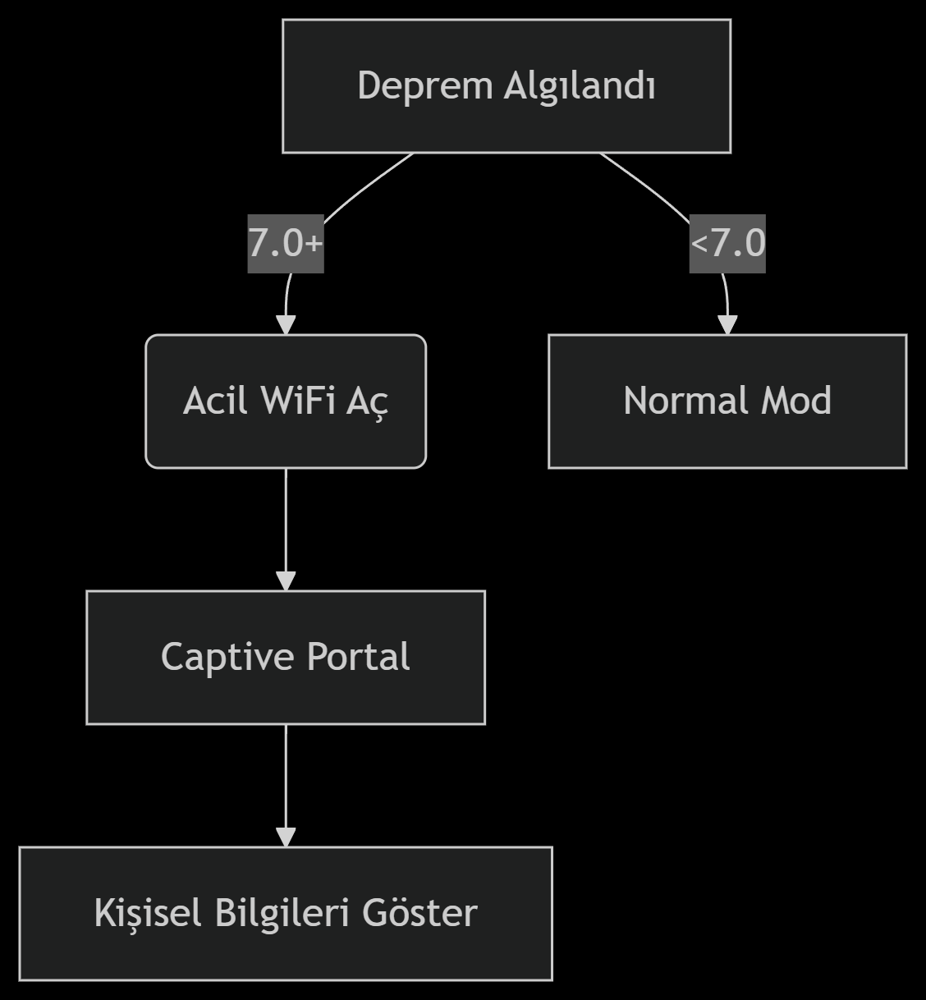

# 🚨 ESP8266 Acil Durum Deprem İletişim Sistemi

### GSM şebekelerine güvenmek yerine kendi iletişim ağını oluştur!


**"6 Şubat felaketi İstanbul'da olsaydı, GSM operatörlerinin hiçbir işe yaramadığını hepimiz görecektik!"**  
Bu proje, 4.2'lik İstanbul depreminde yaşadığım iletişim çöküşünün doğrudan bir sonucudur.

## 📌 Gerçek Bir Hikaye

**23 Nisan 2025, 12:41**  
- 4.2 büyüklüğünde depremle uyandım  
- Telefonumda "Acil Durum Kullanımı Dışında Şebeke Yok" uyarısı  
- Tüm operatörler (Turkcell/Vodafone/Türk Telekom) çöktü  
- **112 dahi çalışmıyordu!**  
- Eğer enkaz altında kalsaydım, kimseye ulaşamayacaktım  
- GSM OPERATÖRLERİNE GÜVENMEYİN!
+ Bu cihaz hayatınızı kurtarabilir

## 🔥 Sistem Özellikleri
- Sadece 200 liraya alabileceğiniz (malum ekonomide kusura bakmayın) Bir ESP8266
- 1 Adet PowerBank veya 5V Batarya


## Özellik	Açıklama
- 🆘 Acil WiFi	Şebekeler çökse bile çalışan özerk ağ
- 📡 Captive Portal	Enkaz altında bile bilgilerinizi yayınlar
- 🚨 Otomatik Alarm	7+ büyüklükte otomatik acil durum modu
- 📱 Modern Arayüz	Bootstrap 5 ile şık tasarım
- 🔄 Gerçek Zamanlı Veri	AFAD'dan canlı deprem bilgisi
  
## 🛠️ Kurulum
Donanım:

ESP8266 (NodeMCU)

Powerbank (en az 10.000mAh)

Su geçirmez kutu

## Yazılım:
```diff

git clone https://github.com/z3x0fly/deprem-acil-sistem.git

platformio run --target upload
```
### Kişisel Bilgileri Ayarla (main.cpp içinde):
```diff
cppconst char* personalInfo = R"({
  "name": "ADINIZ",
  "address": "DETAYLI ADRES",
  "blood_type": "KAN GRUBUNUZ",
  "contact": "ACİL İLETİŞİM NO",
  "home_wifi": {
    "ssid": "EV_WIFI_ADI",
    "password": "WIFI_SIFRESI"
  }
})";
```
## 📸 Sistem Görselleri




## ❓ Neden Bu Proje?
- GSM operatörleri depremde asla güvenilir değil

- 112 bile çöküyor (bizzat denendi!)

- Enkaz altında WiFi sinyali, GSM'den daha güçlü

- Unutmayın: 6 Şubat'ta Hatay'da insanlar GSM olmadığı için öldü!

## 🌍 Topluluk Katkısı

Bu projeyi geliştirmek için:

Deprem simülasyon testleri yapın

Daha fazla bilgi alanı ekleyin (ilaç bilgisi, kronik hastalıklar)

Çoklu dil desteği ekleyin

## ⚠️ ÖNEMLİ UYARI
### "Bu cihazı yapmazsanız ve bir sonraki depremde enkaz altında kalırsanız, telefonunuz sadece ölüm anınızı kaydeden bir alete dönüşecek!"

### BU PROJE BİR DEPREM ÇANTASINDA OLMASI GEREKEN TEMEL EŞYALARDAN BİRİDİR!
